# HOC State Machines

> **Auto-generated** by `scripts/generate_state_machines_md.py`. Do not edit by hand.
> Regenerate after touching any FSM in `state_machines/`. CI fails if this file drifts from the FSM specs.

Each diagram below is exported from a `HocStateMachine` instance via `to_mermaid()`. Triggers shown in the labels are the synthetic names auto-generated from `<source>__to__<dest>`; explicit triggers appear when an FSM module declares them.

## Index

- [CellState](#cellstate)

## CellState

- **States** (9): `ACTIVE`, `EMPTY`, `FAILED`, `IDLE`, `MIGRATING`, `OVERLOADED`, `RECOVERING`, `SEALED`, `SPAWNING`
- **Initial state**: `EMPTY`

```mermaid
stateDiagram-v2
    EMPTY --> IDLE : vcore_added
    IDLE --> EMPTY : vcore_drained_idle
    ACTIVE --> EMPTY : vcore_drained_active
    IDLE --> ACTIVE : tick_started
    ACTIVE --> IDLE : tick_completed
    ACTIVE --> FAILED : tick_failed
    FAILED --> RECOVERING : recovery_started
    RECOVERING --> EMPTY : recovery_completed
    RECOVERING --> IDLE : recovery_restored
    ACTIVE --> FAILED : admin_mark_failed
    EMPTY --> FAILED : admin_mark_failed
    FAILED --> FAILED : admin_mark_failed
    IDLE --> FAILED : admin_mark_failed
    MIGRATING --> FAILED : admin_mark_failed
    OVERLOADED --> FAILED : admin_mark_failed
    RECOVERING --> FAILED : admin_mark_failed
    SEALED --> FAILED : admin_mark_failed
    SPAWNING --> FAILED : admin_mark_failed
    ACTIVE --> IDLE : admin_set_idle
    EMPTY --> IDLE : admin_set_idle
    FAILED --> IDLE : admin_set_idle
    IDLE --> IDLE : admin_set_idle
    MIGRATING --> IDLE : admin_set_idle
    OVERLOADED --> IDLE : admin_set_idle
    RECOVERING --> IDLE : admin_set_idle
    SEALED --> IDLE : admin_set_idle
    SPAWNING --> IDLE : admin_set_idle
    ACTIVE --> RECOVERING : admin_recover
    EMPTY --> RECOVERING : admin_recover
    FAILED --> RECOVERING : admin_recover
    IDLE --> RECOVERING : admin_recover
    MIGRATING --> RECOVERING : admin_recover
    OVERLOADED --> RECOVERING : admin_recover
    RECOVERING --> RECOVERING : admin_recover
    SEALED --> RECOVERING : admin_recover
    SPAWNING --> RECOVERING : admin_recover
    ACTIVE --> EMPTY : admin_reset
    EMPTY --> EMPTY : admin_reset
    FAILED --> EMPTY : admin_reset
    IDLE --> EMPTY : admin_reset
    MIGRATING --> EMPTY : admin_reset
    OVERLOADED --> EMPTY : admin_reset
    RECOVERING --> EMPTY : admin_reset
    SEALED --> EMPTY : admin_reset
    SPAWNING --> EMPTY : admin_reset
    ACTIVE --> ACTIVE : admin_force_active
    EMPTY --> ACTIVE : admin_force_active
    FAILED --> ACTIVE : admin_force_active
    IDLE --> ACTIVE : admin_force_active
    MIGRATING --> ACTIVE : admin_force_active
    OVERLOADED --> ACTIVE : admin_force_active
    RECOVERING --> ACTIVE : admin_force_active
    SEALED --> ACTIVE : admin_force_active
    SPAWNING --> ACTIVE : admin_force_active
```

